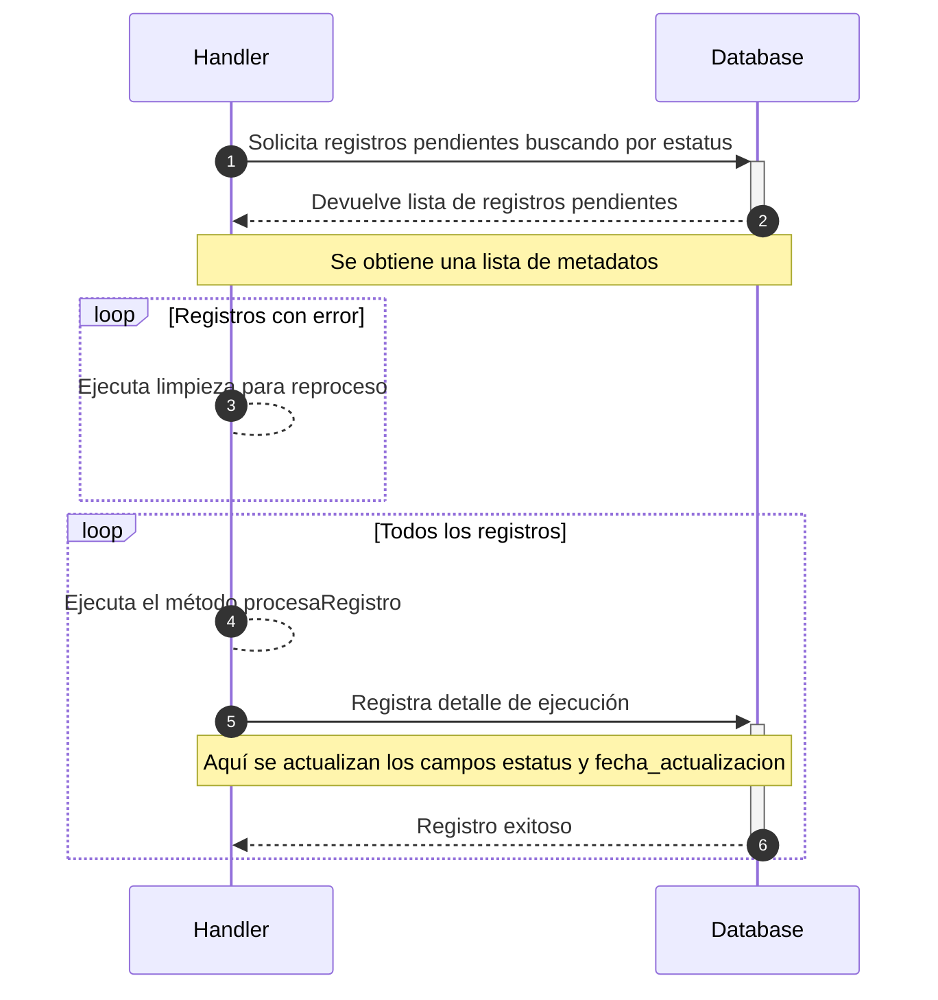

| Tiempo estimado |
|-----------------|
|3  días          |

# Introducción

El ejercicio consiste en la creación de `Handlers` (clases) que ejecutarán tareas diferentes, pero todos se comunicarán a la misma base de datos para el control y seguimiento del proceso.

Cada que se ejecute el programa, deberá ejecutar todos los Handlers de manera secuencial. Ejemplo:

```scala
for (i <- 1 to 3) { generaNuevaEjecucion() }  

new HandlerA().procesar()
new HandlerB().procesar()
new HandlerC().procesar()
```

El método `generaNuevaEjecucion` genera un registro en base de datos que permite llevar el control de la ejecución e informar al usuario de su estatus. En el ejemplo anterior se crearán 3 ejecuciones, por lo que en base de datos tendremos una tabla como la que se muestra a continuación. Se añaden datos de prueba.

| id  | identificador_ejecucion              | estatus | fecha_actualizacion | argumento_handlerA | argumento_handlerB | argumento_handlerC |
| --- |--------------------------------------|---------|---------------------|--------------------|--------------------|--------------------|
| 1   | b266ab85-cf99-4316-856c-c49ddaae4af8 | 0       | 2024-05-31 13:35:00 | 100                | archivo1.json      | 2024-01-01         |
| 2   | 9d2f8fea-6577-46dc-8a4d-f556b342f4ef | 102     | 2024-05-31 13:35:00 | 500                | archivo2.csv       | 2023-01-01         |
| 3   | 2f36dc7a-04b2-46c0-a4a1-1a797be3fe0b | 202     | 2024-05-31 13:35:00 | 900                | archivo3.xml       | 2022-01-01         |

Esta tabla le indicará a cada `Handler` con qué argumentos ejecutar su proceso.

Por ejemplo, cuando ejecute el código anterior, el `HandlerA` hará lo siguiente:

1. Busca en base de datos registros que tengan estatus `0`, ya que es el primer Handler y no debe esperar que otro Handler ejecute algo.
2. Encuentra la fila `1` con el estatus `0`.
3. Ejecuta su proceso con los datos de la columna `argumento_handlerA`.
4. Finaliza la ejecución. Si fue un éxito, reporta estatus `102`, en caso contrario reporta estatus `101`.

A continuación se ejecutará el `HandlerB` y asumiremos que el `handlerA` terminó exitosamente. El `HandlerB`:

1. Busca en base de datos registros que tengan estatus `102`, que son los registros que indican que han sido procesados correctamente por el `HandlerA`.
2. Encuentra las filas `1` y `2`.
3. Ejecuta su proceso con los datos de la columna `argumento_handlerB`.
4. Finaliza la ejecución. Si fue un éxito, reporta estatus `202`, en caso contrario reporta estatus `201`.

Asumiremos una ejecución exitosa para todas las filas:

| id  | identificador_ejecucion              | estatus | fecha_actualizacion | argumento_handlerA | argumento_handlerB | argumento_handlerC |
| --- |--------------------------------------|---------|---------------------|--------------------|--------------------|--------------------|
| 1   | b266ab85-cf99-4316-856c-c49ddaae4af8 | 202     | 2024-05-31 13:35:00 | 100                | archivo1.json      | 2024-01-01         |
| 2   | 9d2f8fea-6577-46dc-8a4d-f556b342f4ef | 202     | 2024-05-31 13:35:00 | 500                | archivo2.csv       | 2023-01-01         |
| 3   | 2f36dc7a-04b2-46c0-a4a1-1a797be3fe0b | 202     | 2024-05-31 13:35:00 | 900                | archivo3.xml       | 2022-01-01         |

A continuación se ejecutará el `HandlerC`:

1. Busca en base de datos registros que tengan estatus `202`, que son los registros que indican que han sido procesados correctamente por el `HandlerA` y el `HandlerB`.
2. Encuentra las filas `1`, `2` y `3`.
3. Ejecuta su proceso con los datos de la columna `argumento_handlerC`.
4. Finaliza la ejecución. Si fue un éxito, reporta estatus `302`, en caso contrario reporta estatus `301`.

Supongamos que de las 3 filas, una termino con error y las demás exitosamente. La tabla se vería de la siguiente manera:

| id  | identificador_ejecucion              | estatus | fecha_actualizacion | argumento_handlerA | argumento_handlerB | argumento_handlerC |
| --- |--------------------------------------|---------|---------------------|--------------------|--------------------|--------------------|
| 1   | b266ab85-cf99-4316-856c-c49ddaae4af8 | 302     | 2024-05-31 13:35:00 | 100                | archivo1.json      | 2024-01-01         |
| 2   | 9d2f8fea-6577-46dc-8a4d-f556b342f4ef | 302     | 2024-05-31 13:35:00 | 500                | archivo2.csv       | 2023-01-01         |
| 3   | 2f36dc7a-04b2-46c0-a4a1-1a797be3fe0b | 301     | 2024-05-31 13:35:00 | 900                | archivo3.xml       | 2022-01-01         |

Cuando se vuelva a ejecutar su programa:

1. Los `handlerA` y `handlerB` no encontrarán registros para procesar.
2. El `handlerC` encontrará el registro con estatus `301`, indicando que la última ejecución no fue exitosa para la fila `3` con el argumento `2022-01-01`.
3. El `handlerC` limpiará el ambiente e intentará volver a ejecutar su proceso con los mismos argumentos de la columna `argumento_handlerC` y actualizará el estatus de acuerdo al resultado del proceso.

# Componentes
  
## Handlers

Un `HandlerX` es una clase que implementa un trait base llamado `Handler`. (`X` representa cualquier sufijo que pueda tener el Handler, usualmente son palabras que describen la tarea que realizará)

El siguiente diagrama ejemplifica el trait `Handler` y cuatro clases que lo implementan: `HandlerA`, `HandlerB`, `HandlerC` y `HandlerD`.

 ```mermaid
  classDiagram
    class Handler {
      <<trait>>
      +Int ESTATUS_INICIO
      +Int ESTATUS_ERROR
      +Int ESTATUS_EXITO
      +Int estatus
      +Long tiempoEjecucionEnSegundos
      +procesaPendientes()
      +procesaRegistro() Boolean
      +obtienePendientes() Seq[String]
      +registraEjecucion()
      +limpiaAmbienteParaReproceso()
    }
  
  Handler <|-- HandlerA : implements
  Handler <|-- HandlerB : implements
  Handler <|-- HandlerC : implements
  Handler <|-- HandlerD : implements
 ```

A continuación se ejemplifica el flujo básico de un `Handler`, el cual consiste en verificar en base de datos si existen pendientes que pueda atender y ejecutar las acciones pertinentes. 

Por ejemplo, si encuentra una fila con un estatus de error, intentará recuperarse de ese error. Si no existe ningún error, pero sí existen filas pendientes por procesar, las procesa de manera normal.



## Modelo de control

Se creará una tabla que almacene el estatus de cada ejecución. Por ejemplo, cuando el programa inicie y se genere una nueva ejecución se creará un registro con el identificador de ejecución y un estatus inicial.

Ejemplo tabla:

| id  | identificador_ejecucion              | estatus | fecha_actualizacion | argumento_handlerA | argumento_handlerB | argumento_handlerC |
| --- |--------------------------------------|---------|---------------------|--------------------|--------------------|--------------------|
| 1   | b266ab85-cf99-4316-856c-c49ddaae4af8 | 0       | 2024-05-31 13:35:00 | 100                | archivo1.json      | 2024-01-01         |

> [!NOTE]  
> Esto solo es una tabla de ejemplo. Para su tarea puede o no utilizar las columnas `argumento_xxx`.

Ejemplo estatus de ejecución:

| Estatus | Descripción                                     |
|---------|-------------------------------------------------|
| 0       | Nueva ejecución registrada. Lista para procesar |
| 100     | Inicio HandlerA                                 |
| 101     | Error HandlerA                                  |
| 102     | Éxito HandlerA                                  |
| 200     | Inicio HandlerB                                 |
| 201     | Error HandlerB                                  |
| 202     | Éxito HandlerB                                  |
| 300     | Inicio HandlerC                                 |
| 301     | Error HandlerC                                  |
| 302     | Éxito HandlerC                                  |

Note como los estatus que terminan en `0` se refieren al inicio del proceso de un Handler, los que terminan en `1` señalan un error y los que terminan en `2` señalan una ejecución exitosa.

Conforme avance el flujo, las columnas `estatus` y `fecha_actualizacion` deberán actualizarse dependiendo de la etapa en la que se encuentre el proceso.

Esto nos permite dar un seguimiento al proceso, que se pueda reiniciar a partir de una etapa específica y que incluso se recupere de errores automáticamente si todos los `Handler`s lo permiten.

# Ejemplo

A continuación revisaremos la estructura del trait `Handler` e implementaremos uno que realice la carga de archivos a Azure Storage. 

Revisando el diagrama proporcionado, vemos que de los tipos de dato que ocupa el trait, no necesitamos crear ninguna clase adicional. Por conveniencia, crearemos una enumeración para almacenar los estatus de cada `Handler` con su significado:

```scala
object EstatusHandler extends Enumeration {
  val LISTO_PARA_PROCESAR = 0
  val INICIO_HANDLER_A = 100
  val ERROR_HANDLER_A = 101
  val EXITO_HANDLER_A = 102
  val INICIO_HANDLER_B = 200
  val ERROR_HANDLER_B = 201
  val EXITO_HANDLER_B = 202
}
```

Nuestro trait `Handler`, que será la base de todos los demás, se crearía de esta manera:

```scala
case class DefinicionRegistro(dato: String, estatus: Int)

trait Handler {
  val ESTATUS_INICIO: Int
  val ESTATUS_ERROR: Int
  val ESTATUS_EXITO: Int
  var estatus: Int = _
  var tiempoEjecucionEnSegundos: Long = 0

  def procesaPendientes(): Unit = {
    try {
      estatus = ESTATUS_INICIO
      obtienePendientes().foreach { pendiente =>
        if (pendiente.estatus == ESTATUS_ERROR) {
          limpiaAmbienteParaReproceso(pendiente)
        }
        procesaRegistro(pendiente)
        registraEjecucion(pendiente)
      }
      estatus = ESTATUS_EXITO
    } catch {
      case e: Exception =>
        estatus = ESTATUS_ERROR
    } finally {
      tiempoEjecucionEnSegundos = 123L
    }
  }

  def procesaRegistro(data: DefinicionRegistro): Boolean
  def obtienePendientes(): Seq[DefinicionRegistro]
  def registraEjecucion(data: DefinicionRegistro): Unit
  def limpiaAmbienteParaReproceso(data: DefinicionRegistro): Unit
}
```

Observe que existen campos y métodos que no tienen una implementación, estos deberán ser completados cuando una clase implemente este trait.

El método que se proporciona es `procesaPendientes`, ya que hasta este momento, se asume que todos los Handlers seguirán ese mismo flujo.

Ahora codificaremos el `HandlerCargaAzure`. Aquí es donde terminamos de implementar la funcionalidad y en lugar de escribir el mismo código para cada Handler en el método `procesaPendientes`, reutilizaremos el código base.

```scala
class HandlerCargaAzureBlob extends Handler {
  override val ESTATUS_INICIO: Int = EstatusHandler.INICIO_HANDLER_CARGA_ARCHIVOS
  override val ESTATUS_ERROR: Int = EstatusHandler.ERROR_HANDLER_CARGA_ARCHIVOS
  override val ESTATUS_EXITO: Int = EstatusHandler.EXITO_HANDLER_CARGA_ARCHIVOS

  /** Procesa el registro obtenido.
    */
  override def procesaRegistro(data: DefinicionRegistro): Boolean = {
    log(s"Procesando registro ${data}")
    true
  }

  /** Solicitar a base de datos registros pendientes de acuerdo al estatus, en este ejemplo se
    * regresa un Seq, pero aquí deberá usar Slick para traer registros de base de datos.
    */
  override def obtienePendientes(): Seq[DefinicionRegistro] = {
    Seq(DefinicionRegistro("Dato1", 0))
  }

  /** Actualizar métricas y estatus en base de datos.
    */
  override def registraEjecucion(data: DefinicionRegistro): Unit = {
    log(s"Actualizando datos en base de datos para el registro ${data}")
  }

  /** Si el registro que se recibe se encuentra con un estatus de error, este método se ejecutará
    * para limpiar el ambiente y que el proceso "normal" pueda ejecutarse sin problemas.
    */
  override def limpiaAmbienteParaReproceso(data: DefinicionRegistro): Unit = {
    log(s"Limpiando ambiente. Eliminando archivo en Azure con los datos $data")
  }

  private def log(str: => String): Unit = {
    println(s"${java.time.LocalDateTime.now} $str")
  }
}
```

# Instrucciones ejercicio

1. Crear una instancia local de PostgreSQL con Docker.
2. Crear una instancia local de Azure Storage con [Azurite](https://github.com/Azure/Azurite) y Docker.
3. Crear el esquema teia y las tablas correspondientes en PostgreSQL para el esquema de control.
4. Crear el contenedor `cargaarchivos` y la tabla `tablaarchivos`.
5. Crear un nuevo proyecto en IntelliJ IDEA.
6. Crear el `HandlerCargaAzureBlob`.
7. Crear el `HandlerCargaAzureTable`
8. Crear una clase que coordine los Handlers mencionados y que obtenga las cadenas de conexión y nombres de contenedores y tablas a través de un archivo de configuración.
9. Insertar 3 registros en base de datos para que sean procesados por los Handlers.
10. Ejecutar los Handlers, describir el proceso y obtener evidencia de la ejecución exitosa en un video o en un documento en formato Markdown. Si prefiere grabar, puede utilizar la Snipping Tool de Windows, [ZoomIt de Sysinternals](https://learn.microsoft.com/en-us/sysinternals/downloads/zoomit), [OBS](https://obsproject.com/) u otro software de su preferencia.

## Referencias

1. [Chain of responsibility](https://refactoring.guru/design-patterns/chain-of-responsibility)
